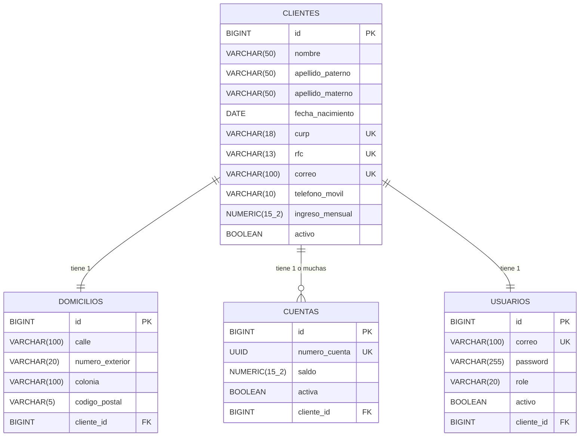

# Microservicio de Usuarios y Onboarding de Clientes

Este microservicio se encarga de la gestión integral del ciclo de vida de los clientes, desde su onboarding inicial (registro de datos personales, fiscales y domicilio) hasta la creación automática de su cuenta financiera y credenciales de acceso seguro.

## Entregables Cumplidos (Rúbrica)

### 1. Diseño de Base de Datos y Optimizaciones
Se aplicaron las mejores prácticas en el diseño relacional y la elección de tipos de datos para asegurar el uso eficiente de memoria e integridad referencial.

#### Diagrama Entidad-Relación (ERD)

#### Modelo de Datos:
* **`clientes`**: Almacena información personal, laboral y de contacto. Uso de `VARCHAR` con límites estrictos (`CURP` a 18, `RFC` a 13) para optimización de almacenamiento. Los campos únicos (`CURP`, `RFC`, `correo`) tienen índices automáticos para agilizar las búsquedas.
* **`cuentas`**: Usa `UUID` para generar identificadores de cuenta matemáticamente únicos y seguros (previniendo enumeración). El saldo se maneja con `Double`/`NUMERIC(15_2)` para operaciones financieras.
* **`usuarios`**: Almacena credenciales de acceso y el Rol (`ADMIN` o `CLIENTE`). La contraseña nunca se guarda en texto plano (cifrada con BCrypt).

### 2. Validaciones Implementadas (Reglas de Negocio)
Se implementó un sistema dual de validación (Nivel Entity/DTO y Nivel Servicio):
- **Validaciones de Formato:** Uso de expresiones regulares (`@Pattern`) para validar el CURP, el RFC, el correo y contraseñas fuertes.
- **Validaciones Transaccionales (Pagos y Recargas):** Al pagar o recargar, el sistema valida que el **monto sea mayor a 0** (previniendo hackeos lógicos con números negativos). También verifica saldo insuficiente al pagar.
- **Validación de Cuentas Inactivas:** Si un cliente se da de baja, el sistema arroja `CuentaInactivaException` e impide más transacciones (403 Forbidden).
- **Baja Lógica:** Se implementó el borrado lógico; en lugar de ejecutar un `DELETE` físico, se inhabilita el Cliente, su Usuario y su Cuenta bancaria en cascada.

### 3. Excepciones Personalizadas
- `ClienteYaRegistradoException` (409 Conflict)
- `CurpDuplicadaException`, `RfcDuplicadoException`, `CorreoDuplicadoException` (409 Conflict)
- `ContrasenaInvalidaException`, Spring Validation (400 Bad Request)
- `CuentaInactivaException` (403 Forbidden)
- `ClienteNoEncontradoException` (404 Not Found)

---

## 🚀 Endpoints de la API REST y Roles de Seguridad

El microservicio expone los endpoints protegidos mediante token JWT. Existen políticas de autorización estrictas:

### Autenticación
* `POST /api/auth/login`: (Abierto) Autentica a un usuario y devuelve el token JWT.

### Clientes (Autoservicio y Gestión)
* `POST /api/clientes`: (Abierto) Registra un nuevo cliente (crea su cuenta y usuario automáticamente).
* `GET /api/me/perfil`: (`CLIENTE`) Extrae del Token JWT la identidad del usuario y retorna sus datos protegidos.
* `POST /api/me/reconocimiento-facial`: (`CLIENTE`) Endpoint de innovación con `MultipartFile` para simulación de verificación de identidad.
* `DELETE /api/clientes/{id}`: (`ADMIN`, `CLIENTE`) Realiza la **baja lógica** del cliente y desactiva su usuario y cuentas.

### Consultas Administrativas (Solo `ADMIN`)
* `GET /api/clientes`: Lista todos los clientes.
* `GET /api/clientes/activos`: Lista solo clientes dados de alta.
* `GET /api/clientes/correo/{correo}` / `rfc/{rfc}`: Búsquedas indexadas específicas.

### Transacciones Financieras (Cuentas)
* `POST /api/cuentas/{numero}/recargar`: Abona dinero validando montos > 0 y estatus de cuenta.
* `POST /api/cuentas/{numero}/pagar`: Resta dinero validando montos > 0, fondos suficientes y estatus.
* `GET /api/cuentas/{numero}/historial`: Consulta el historial financiero.

---

## 🛠️ Instrucciones de Ejecución y Pruebas
1. Ejecutar el proyecto: `./mvnw spring-boot:run`
2. Abrir **Swagger OpenAPI**: `http://localhost:8080/swagger-ui/index.html`
3. Crear un cliente -> Iniciar sesión -> Copiar Token JWT -> Pegarlo en el botón verde **Authorize**.
