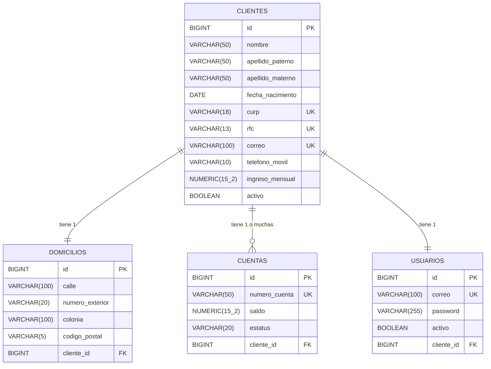

# Proyecto Integrador: Onboarding de Clientes Personas Físicas


Este repositorio contiene la implementación completa del microservicio para el proceso de *Onboarding* de clientes (personas físicas) de una institución financiera. Cumple con todos los requerimientos funcionales, de persistencia, seguridad (JWT) y manejo exhaustivo de excepciones.

---

## 📖 Documento Técnico de la Solución

### Arquitectura y Patrones
El proyecto sigue una arquitectura multicapa (N-Tier) basada en el framework **Spring Boot**, dividida lógicamente en:
- **Controladores (Controllers):** Exponen la API RESTful.
- **Servicios (Services):** Contienen la lógica de negocio y validaciones.
- **Repositorios (Repositories):** Interfaces de Spring Data JPA para el acceso a datos.
- **Entidades (Entities):** Representación orientada a objetos de la base de datos (ORM con Hibernate).
- **Manejo Global de Excepciones:** A través de `@ControllerAdvice` para capturar excepciones personalizadas y estandarizar las respuestas HTTP.
- **Seguridad (Security):** Uso de Spring Security con autenticación basada en JWT (JSON Web Tokens) y cifrado de contraseñas con BCrypt.

### 1. Diseño de Base de Datos y Optimizaciones
Se aplicaron las mejores prácticas en el diseño relacional y la elección de tipos de datos para asegurar el uso eficiente de memoria e integridad referencial.

#### Diagrama Entidad-Relación (ERD)


#### Modelo de Datos:
* **`clientes`**: Almacena información personal, laboral y de contacto. Uso de `VARCHAR` con límites estrictos (`CURP` a 18, `RFC` a 13) para optimización de almacenamiento. Los campos únicos (`CURP`, `RFC`, `correo`) tienen índices automáticos para agilizar las búsquedas.
* **`domicilios`**: Relación **1:1** con `clientes`. Separado lógicamente para normalización.
* **`cuentas`**: Relación **1:N** con `clientes`. El saldo se maneja con el tipo de dato `BigDecimal` en Java (y `NUMERIC` en SQL) para evitar pérdida de precisión en operaciones financieras. El número de cuenta es único.
* **`usuarios`**: Relación **1:1** con `clientes`. Almacena credenciales de acceso. La contraseña nunca se guarda en texto plano (cifrada con BCrypt).

### 2. Validaciones Implementadas (Reglas de Negocio)
Se implementó un sistema dual de validación (Nivel Entity/DTO y Nivel Servicio):
- **Validaciones de Formato:** Uso de expresiones regulares (`@Pattern`) para validar el CURP, el RFC, el correo electrónico y asegurar que la contraseña tenga mínimo 8 caracteres, mayúsculas, minúsculas, números y caracteres especiales.
- **Validación de Mayoría de Edad:** Al registrar un cliente, se calcula la diferencia de tiempo respecto a la fecha de nacimiento para asegurar que es mayor de 18 años.
- **Validaciones de Unicidad:** El sistema previene el registro duplicado verificando en la BD si la CURP, RFC o el correo ya existen.
- **Baja Lógica:** Se implementó el borrado lógico; en lugar de ejecutar un `DELETE` físico en la BD, se cambia el estado del cliente y automáticamente se inhabilita el `Usuario` asociado.

### 3. Excepciones Personalizadas
Para un código limpio y legible, se crearon excepciones de negocio específicas que son capturadas por el `GlobalExceptionHandler`:
- `ClienteYaRegistradoException` (409 Conflict)
- `CurpDuplicadaException`, `RfcDuplicadoException`, `CorreoDuplicadoException` (409 Conflict)
- `ContrasenaInvalidaException` (400 Bad Request)
- `ClienteNoEncontradoException`, `UsuarioNoEncontradoException`, `CuentaNoEncontradaException` (404 Not Found)
- Y el manejo automático de errores de Spring Validation (`Error de validación`) y Spring Security (`Credenciales inválidas`, `Usuario inactivo`).

---

## 🚀 Endpoints de la API REST

El microservicio expone los siguientes endpoints (protegidos mediante token JWT, excepto login y registro):

### Autenticación
* `POST /api/auth/login`: Autentica a un usuario y devuelve el token JWT.

### Clientes
* `POST /api/clientes`: Registra un nuevo cliente (crea su cuenta bancaria y usuario de acceso simultáneamente).
* `GET /api/clientes`: Lista todos los clientes activos.
* `GET /api/clientes/{id}`: Consulta cliente por ID.
* `GET /api/clientes/cuenta/{numeroCuenta}`: Consulta cliente mediante su número de cuenta.
* `PUT /api/clientes/{id}`: Actualiza los datos permitidos del cliente.
* `DELETE /api/clientes/{id}`: Realiza la **baja lógica** del cliente y desactiva su usuario.

### Usuarios
* `GET /api/usuarios/{id}`: Obtiene información del usuario de acceso.
* `PUT /api/usuarios/{id}/password`: Actualiza la contraseña del usuario (validando reglas de seguridad).

---

## 🗄️ Script de Base de Datos (DDL)
Aunque Spring Boot (Hibernate) genera automáticamente las tablas gracias a la propiedad `ddl-auto=update`, aquí se adjunta el script DDL equivalente para la creación manual de la base de datos optimizada:

```sql
CREATE DATABASE gestopago_usuarios;

\c gestopago_usuarios;

CREATE TABLE clientes (
    id BIGSERIAL PRIMARY KEY,
    nombre VARCHAR(50) NOT NULL,
    segundo_nombre VARCHAR(50),
    apellido_paterno VARCHAR(50) NOT NULL,
    apellido_materno VARCHAR(50) NOT NULL,
    fecha_nacimiento DATE NOT NULL,
    curp VARCHAR(18) UNIQUE NOT NULL,
    rfc VARCHAR(13) UNIQUE NOT NULL,
    sexo VARCHAR(20),
    nacionalidad VARCHAR(50),
    estado_civil VARCHAR(50),
    correo VARCHAR(100) UNIQUE NOT NULL,
    telefono_movil VARCHAR(10) NOT NULL,
    telefono_alternativo VARCHAR(10),
    ocupacion VARCHAR(100),
    empresa VARCHAR(100),
    ingreso_mensual NUMERIC(15,2) CHECK (ingreso_mensual > 0),
    activo BOOLEAN DEFAULT TRUE,
    fecha_creacion TIMESTAMP DEFAULT CURRENT_TIMESTAMP,
    fecha_actualizacion TIMESTAMP DEFAULT CURRENT_TIMESTAMP
);

CREATE TABLE domicilios (
    id BIGSERIAL PRIMARY KEY,
    calle VARCHAR(100) NOT NULL,
    numero_exterior VARCHAR(20) NOT NULL,
    numero_interior VARCHAR(20),
    colonia VARCHAR(100) NOT NULL,
    municipio VARCHAR(100) NOT NULL,
    estado VARCHAR(100) NOT NULL,
    codigo_postal VARCHAR(5) NOT NULL,
    pais VARCHAR(50) NOT NULL,
    cliente_id BIGINT UNIQUE REFERENCES clientes(id)
);

CREATE TABLE cuentas (
    id BIGSERIAL PRIMARY KEY,
    numero_cuenta VARCHAR(50) UNIQUE NOT NULL,
    saldo NUMERIC(15,2) NOT NULL CHECK (saldo >= 0),
    estatus VARCHAR(20) NOT NULL DEFAULT 'ACTIVA',
    cliente_id BIGINT REFERENCES clientes(id)
);

CREATE TABLE usuarios (
    id BIGSERIAL PRIMARY KEY,
    correo VARCHAR(100) UNIQUE NOT NULL,
    password VARCHAR(255) NOT NULL,
    activo BOOLEAN DEFAULT TRUE,
    cliente_id BIGINT UNIQUE REFERENCES clientes(id),
    fecha_creacion TIMESTAMP DEFAULT CURRENT_TIMESTAMP,
    fecha_actualizacion TIMESTAMP DEFAULT CURRENT_TIMESTAMP
);

-- Índices para optimización de consultas frecuentes
CREATE INDEX idx_cliente_curp ON clientes(curp);
CREATE INDEX idx_cliente_rfc ON clientes(rfc);
CREATE INDEX idx_cuenta_numero ON cuentas(numero_cuenta);
```

---

## 🛠️ Instrucciones de Ejecución y Pruebas

### 1. Ejecutar la Aplicación
Tener configurado PostgreSQL en el puerto (por defecto local o en Docker) y ejecutar en la raíz del proyecto:
```bash
./mvnw spring-boot:run
```

### 2. Pruebas y Evidencias (Swagger)
El proyecto incluye OpenAPI (Swagger) para facilitar la visualización y prueba interactiva de los endpoints.
1. Una vez iniciada la aplicación, ingresar a: `http://localhost:8080/swagger-ui/index.html`
2. **Evidencia de Validación:** En el endpoint de creación de clientes, al intentar enviar datos inválidos (como un teléfono de 5 dígitos), el sistema responderá con Status `400 Bad Request` y el mensaje `"Error de validación"`.
3. **Evidencia de Flujo Completo:** 
   - Crear un cliente (obteniendo de respuesta su ID de cliente y número de cuenta autogenerado).
   - Iniciar sesión en `/api/auth/login` con el correo registrado y la contraseña que se definió.
   - Insertar el Token JWT retornado en el botón verde **"Authorize"** de Swagger.
   - Usar el endpoint de cuenta para validar la persistencia de datos.

---
